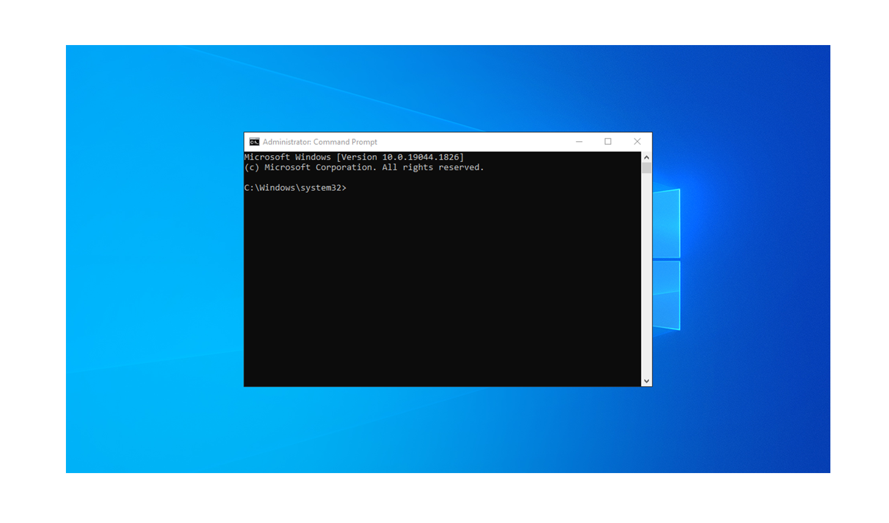
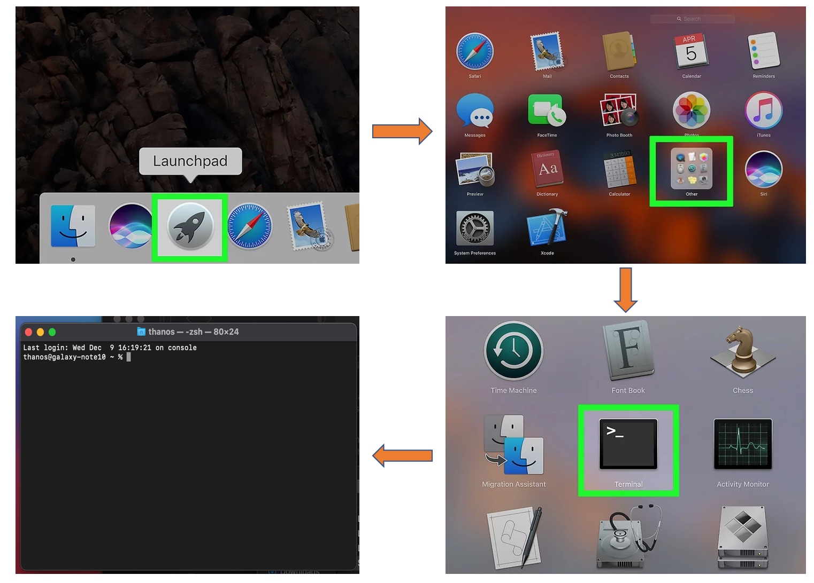
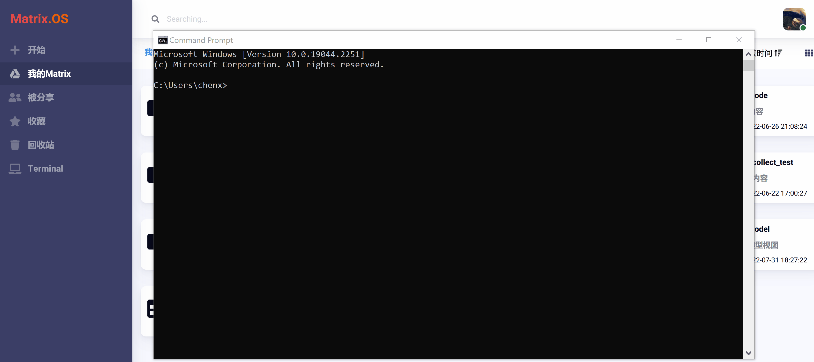
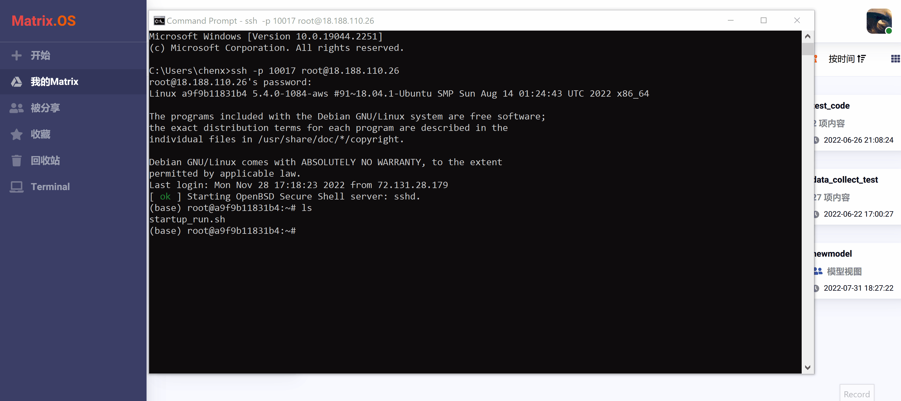
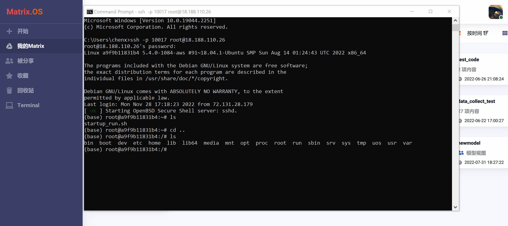

# 本地终端 (Local Terminal)

相比使用网络终端，我们更推荐您使用个人计算机上的本地终端工具，来连接 Matrix.OS 并且更快捷高效完成全部系统管理操作。

## Windows 命令行工具

Windows 命令提示符（即 cmd）是 Windows 系统的一种命令行操作工具，用户可以通过输入命令来完成各种系统或程序操作。如下图示例：



可采用以下几种方法在 Windows 打开 cmd 命令提示符窗口：

* 方法一：开始菜单 -> Windows 系统 -> 命令提示符。
* 方法二：按下快捷键 Win + R 打开运行，输入 cmd 回车。
* 方法三：点击任务栏搜索按钮，搜索 cmd 并打开。
* 方法四：在资源管理器的地址栏输入 cmd 并回车，cmd 打开后会自动定位到当前目录。
* 方法五：右键点击开始菜单的 Win 图标 -> 命令提示符。

关于Windows 命令行工具的详细使用方法，请参考《[Windows 命令](https://learn.microsoft.com/zh-cn/windows-server/administration/windows-commands/windows-commands)》。

## MacOS 终端工具

Mac Terminal 为 macOS 提供了命令行界面。Terminal 中的每个窗口都代表着 shell 进程的一个实例。窗口包含提示，表明您可以输入命令。您所看到的提示取决于你的 Terminal 和 shell 设置，但它通常包括您要登录的主机的名称、您当前的工作文件夹、您的用户名以及一个提示符号。

例如，如果名为 abc 的用户正在使用默认的 zsh shell，提示就会显示为：

```
abc@MacBook-Pro ~ %
```
这表示名为 abc 的用户登录了名为 "MacBook-Pro" 的电脑，而波浪符号 (~) 表示当前文件夹为其个人文件夹。

在Mac中打开终端工具，可使用 LaunchPad，在 "Other" 文件夹下找到 "Terminal"，单击即可打开终端工具，如下图所示：



关于 Mac Terminal 的详细使用方法，请参考《[Mac终端使用手册](https://support.apple.com/zh-cn/guide/terminal/welcome/2.13/mac)》

## 建立ssh连接

在终端窗口输入命令：

```
ssh -p [端口号] root@[Matrix主机名或IP地址]
```

回车后，命令行会提示输入您在 Matrix 的用户密码，输入密码后按回车键，即建立对 Matrix.OS 的连接。以 Windows 为例，连接过程如下图所示：



## 访问云桌面

连接虚拟环境成功后，输入 `cd ..` 命令，进入上一级目录，然后 `ls` 列出内容如下：



其中，"uos" 文件夹包含着所有 Matrix.OS 上的组件和文件。可使用 `cd` 命令进入 "uos"。再使用 `ls` 命令浏览 uos 下的全部内容，如下图所示：



用户可以在本地终端使用 Linux 命令对 uos 进行各种文件管理操作，常用命令参见《[常用CLI命令操作](zh-cn/userguide/os/tools/terminals/command.md)》。