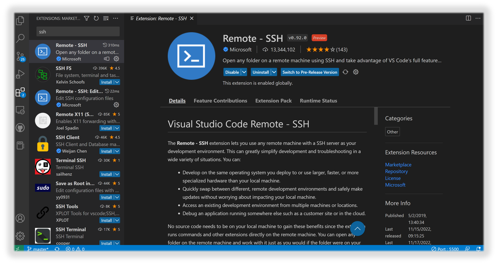
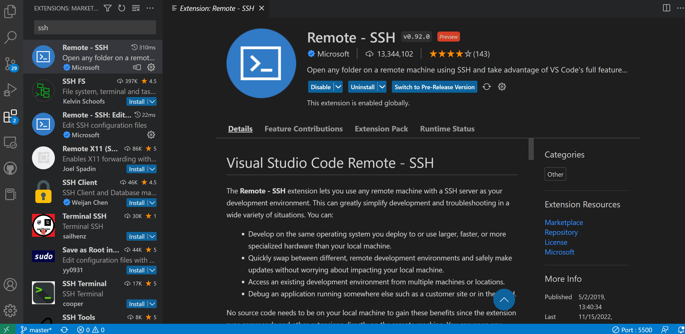
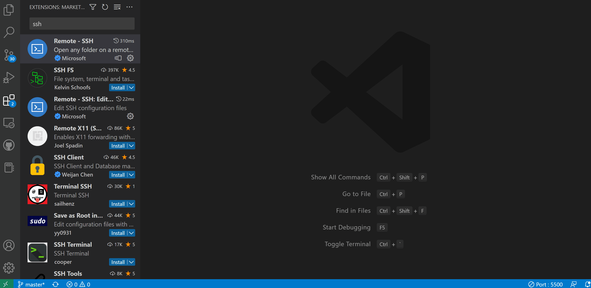
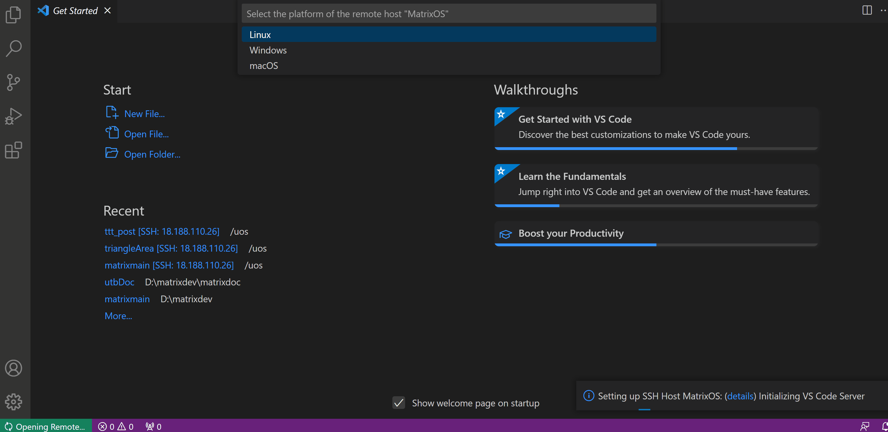
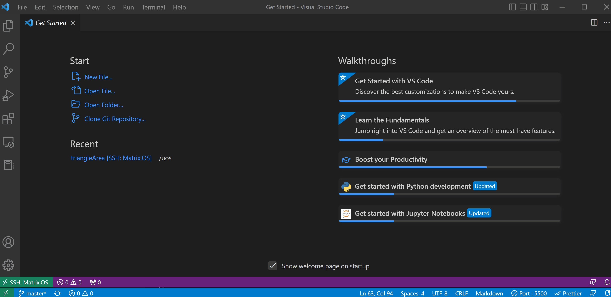
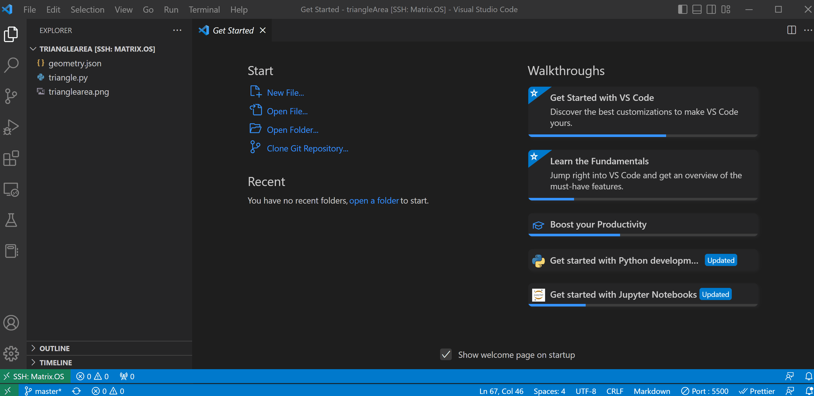

# 使用 Remote - SSH

很多代码编辑器或集成开发环境 IDE 都支持使用 SSH 连接远程主机进行文件管理、代码编写、开发、调试与部署。本文以微软的 Visual Studio Code (VSCode) 为例，详细介绍使用 Remote - SSH 连接 Matrix.OS 云桌面，并使用 VSCode 终端来实现对 Matrix.OS 的远程管理。

关于使用 VSCode 在 Matrix.OS 实现远程代码编写、调试、部署上线的方法会在后续教程中介绍，在此就不赘述了。

**注意：Remote - SSH 插件是基于 OpenSSH 的，因此在您的计算机上需要装有 OpenSSH 的客户端，才可以通过这个插件连接到 Matrix.OS，否则 VSCode 会报错。**

不同计算机平台下 OpenSSH 客户端的安装，请参考 VSCode 官方文档《[Installing a supported SSH client](https://code.visualstudio.com/docs/remote/troubleshooting#_installing-a-supported-ssh-client)》一节的内容，在此不再赘述。

关于 Remote - SSH 更详细的说明与使用配置，请参考官方文档:《[Remote Development using SSH](https://code.visualstudio.com/docs/remote/ssh)》。

## 什么是 Remote - SSH

Remote - SSH 是微软发布的 VSCode Remote 功能插件的之一，如下图所示：



使用 Remote - SSH，您可以：

* 从多台设备或位置访问 Matrix.OS 云桌面与开发环境。
* 在不同的 Matrix.OS 开发环境之间快速切换并同步更新。
* 调试运行在 Matrix.OS 上的所有程序组件。
* 访问您在 Matrix.OS 上的文件系统并进行远程管理。

## 安装 Remote - SSH

打开 VSCode，然后在最左侧工具栏中找到 Extensions 项 (即扩展选项卡)，进入然后在搜索窗口中输入：Remote - SSH（或者 ssh 关键字）。找到所对应的插件之后，点击 "Install(安装)" 即可开始安装。稍等片刻安装完成后，在工具栏中会出现一个 Remote-SSH 按钮 ，同时在左下角状态栏会出现"开启远程连接窗口"图标  ，即表示安装成功。



## 建立SSH连接

### 配置SSH连接文件

Remote - SSH 安装完成后，可以点击左下角状态栏  图标，开启远程连接窗口，选择第一项 `Connect to Host...`，再进一步选择 `Configure SSH Hosts...`，即打开 SSH 连接配置文件，如下图所示：


在配置文件中，您可以按照下面格式来配置与 Matrix.OS 的连接，请根据您个人计算机的信息来定制填写即可。

```
Host Matrix.OS
    HostName [主机IP地址]
    Port [连接端口号]
    User root
    IdentityFile [SSH key 文件 id_rsa在本地电脑的路径]
```

### 连接到 Matrix.OS

完成配置后，保存该配置文件。再次点击左下角状态栏  图标，开启远程连接窗口，选择 `Connect to Host...`，此时可以发现刚刚配置好的 "Matrix.OS" 已经被成功添加到下拉菜单中，点击选中它，即打开 VSCode Remote 视窗，如下图所示：



接下来，请在 VSCode Remote 下拉式菜单中，选定连接 Matrix.OS 的系统为 `Linux`，然后在弹出的窗口输入您在 Matrix 平台的登录密码并回车。稍作等待，即完成 VSCode Remote 与 Matrix.OS 的连接，左下角状态栏的 SSH 连接名也变为了`SSH: Matrix.OS`，说明连接成功。如下图所示：



这时可以在 VSCode Remote 中打开访问您在 Matrix.OS 上的文件和文件夹了，如下图所示：



## 使用终端

成功连接后，您可以在 VSCode Remote 打开终端，使用 Linux 命令来管理 Matrix.OS 上的程序组件和文件。在 `Terminal` 菜单选择 `New Terminal`，即可新建打开终端窗口。如下图所示：



常用 Linux 命令参见《[常用CLI命令操作](zh-cn/userguide/os/tools/terminals/command.md)》。