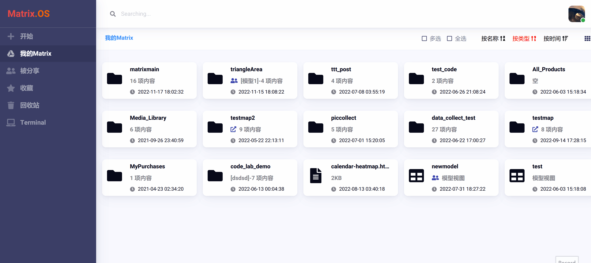
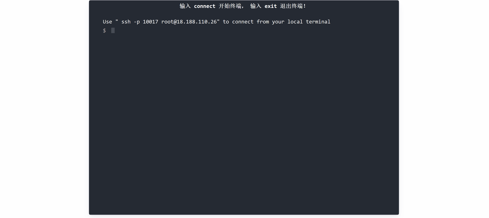
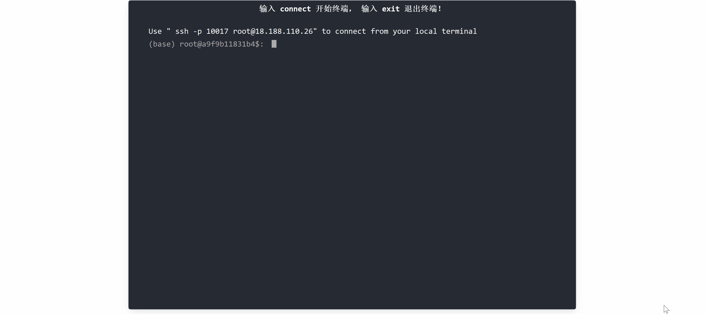
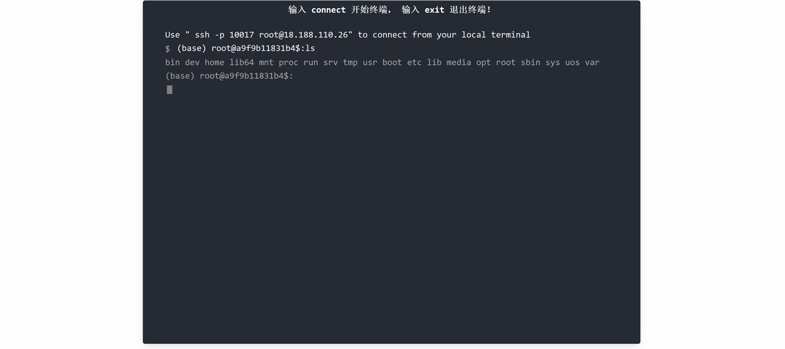
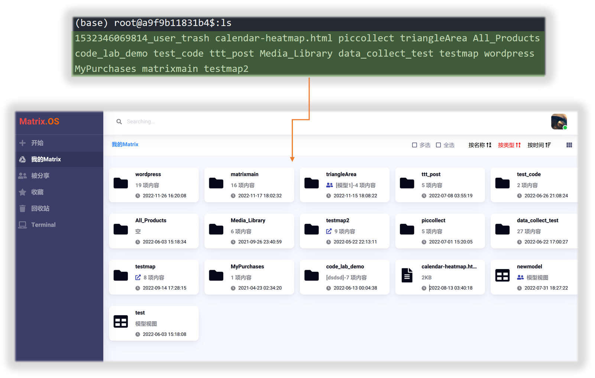

# 网络终端(Web Terminal)

## 开启网络终端

点击左侧导航栏中的`Terminal`按钮，即在浏览器新页面打开Matrix.OS网络终端，如下图所示：



## 连接虚拟环境

在终端窗口输入命令：

```
connect
```

回车，即成功连接到您的Matrix.OS虚拟环境。如下图所示：



以上图为例，连接虚拟环境成功后，命令行显示：

```
(base) root@a9f9b11831b4$:
```

其中，base是平台默认分配给每个用户的虚拟环境名，root是用户权限，"a9f9b11831b4"则是用户在Matrix.OS的标识。

## 访问云桌面

连接虚拟环境成功后，在命令行输入：

```
ls
```
即列出全部文件夹和文件，如下图所示：



可以发现包括以下文件夹：

* `bin`
* `dev`
* `home`
* `lib64`
* `mnt`
* `proc`
* `run`
* `srv`
* `tmp`
* `usr`
* `boot`
* `etc`
* `lib`
* `media`
* `opt`
* `root`
* `sbin`
* `sys`
* `uos`
* `var`

其中，"uos"文件夹包含着所有Matrix.OS上的组件。可使用`cd`命令进入"uos"。再使用`ls`命令浏览uos下的全部内容，如下图所示：



可以发现，ls所列出的"uos"文件内容与Matrix.OS云桌面上的内容完全一致，如下图：



用户完全可以在网络终端使用Linux命令对uos进行各种文件管理操作，常用命令参见《[常用CLI命令操作](zh-cn/userguide/os/tools/terminals/command.md)》。